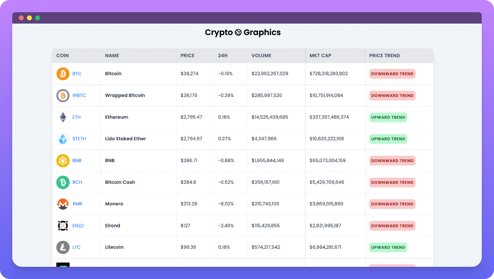
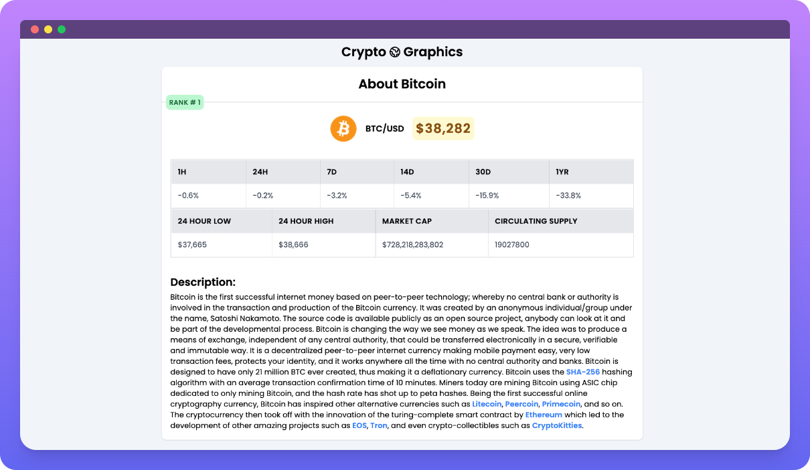

### 🔥 Crypto Schedule

Application for displaying up-to-date information about the state of the cryptocurrency market.

**[Demo](https://crypto-app-react-01.vercel.app/)**

----

#### 🍀 Screenshots:
**Main Page:**

**Detail Page:**

-----

#### 🍀 Use links

- [CoinGecko API](https://api.coingecko.com/api/v3/coins/)

-----

#### 🍀 Tech Stack

**Client:**

- [React](https://ru.reactjs.org/)
- [Redux](https://redux.js.org/)
- [Redux Toolkit](https://redux-toolkit.js.org/)
- [TailwindCSS](https://tailwindcss.com/)
- [Sass](https://sass-lang.com/)
- [Axios](https://axios-http.com/docs/intro)

#### 🍀 Authors

- [@unnamedev](https://github.com/unnamedev)

